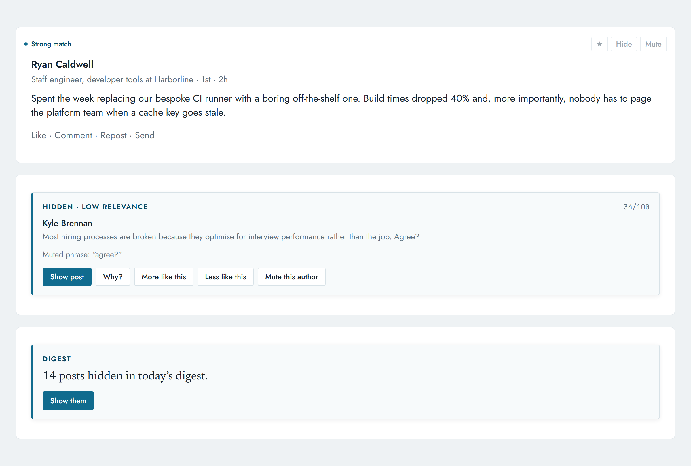

# Clean Slate

Your LinkedIn feed fills up with things you never asked for: ads, promoted posts, engagement bait, strangers' hot takes, and the endless self-congratulation. Clean Slate lets you decide what stays.

You set the topics and the people that matter, and every post is scored against your rules rather than someone else's. Nothing is deleted. Anything it hides is one click from being read, with the reason it was hidden.

Everything runs in your browser. No server, no account, no analytics, no network calls. You can check that in the source: the extension makes zero requests, and even the typefaces are bundled rather than fetched.

**English-language feeds only.** Clean Slate reads the words on your feed to score posts, and the words it knows are English ones. On a feed set to any other language it still runs, but adverts, polls and engagement bait come through unfiltered. Other languages are a later pass, not a promise. The toolbar popup tells you when it has landed on a feed it cannot fully read.

*Every post shown is invented. The interface is the real thing, rendered with the extension's own stylesheet and typefaces.*

## What it does

Scores every post from 0 to 100 using rules you can read: your topics, muted phrases, connection degree, whether the post reached you because someone you know reacted to it, engagement-bait patterns, and more.

Low scores are hidden behind a compact card showing the author, a snippet, the score and the reason it scored down. One click opens a hidden post, another shows the full arithmetic without opening it.

Other things it does:

- **Learns from you.** Every star, hide, mute and reveal trains a small on-device classifier (naive Bayes, the spam-filter approach). The words it learns are listed on the preferences page, and you can promote any of them to a permanent rule or wipe the model.
- **Never-miss list.** Mark people whose posts always stay visible.
- **Forgets a grudge.** Muting someone from the feed fades over a month. Names you type on the preferences page stay until you remove them.
- **Profiles.** Keep more than one set of topics and muted phrases and switch between them from the toolbar. People, page cleanup and the learned model stay shared.
- **Digest mode.** Show only the day's best posts and put the rest behind one summary card.
- **Review page.** Audit what it hid, today or the last seven days or everything it still has, and judge each call. Your verdicts train the model, and it remembers which ones you have been through.
- **Page cleanup.** Hides the right-hand rail (news, puzzles, ads) and the left sidebar extras. Both are on by default and both can be turned off in Preferences.

## Reading modes

Switch from the toolbar button. The choice applies until you change it.

| Mode | What you see |
| --- | --- |
| **Focus** | Only high-confidence matches. Everything else is hidden. |
| **Discover** | The balanced default. Obvious noise is hidden, borderline posts dim. |
| **Digest** | Only the day's best posts. The rest collapse behind one summary card. |
| **Raw** | LinkedIn, untouched. |

## What it does not do

- No automation. No auto-liking, following, commenting, messaging or connection requests.
- No scraping. It reads the page you are already looking at, in your own browser session.
- No data collection. Preferences, counters, the learned model and a log of the posts it hid live in local extension storage and never leave your machine. That log keeps the author and up to 600 characters of each hidden post, capped at the 200 most recent, so the review page can show you what was hidden. See [PRIVACY.md](PRIVACY.md). You can delete it any time from Preferences.

## Install

There is no store listing yet, so Clean Slate is installed by hand. It takes about a minute and you do not need Git or any developer tools.

**1. Download it.** Get the zip from the [latest release](https://github.com/startupmark/clean-slate/releases/latest). It is named for the version, such as `clean-slate-0.1.0.zip`.

**2. Unzip it.** You will get a folder called `clean-slate`. Put it somewhere you will not delete by accident, such as your Documents folder. Chrome reads the extension from this folder every time it starts, so moving or deleting it later uninstalls Clean Slate.

**3. Open your browser's extensions page.** Type `chrome://extensions` in the address bar and press Enter. On Edge, type `edge://extensions` instead.

**4. Turn on Developer mode.** The switch is in the top right corner on Chrome, and in the left sidebar on Edge. This is what allows an extension to be installed from a folder rather than a store.

**5. Click "Load unpacked"** and select the `clean-slate` folder you unzipped. Select the folder itself, not a file inside it. The folder is the right one if it contains `manifest.json`.

**6. Open the LinkedIn home feed.** Clean Slate starts working immediately, and a welcome card explains what it changed. The Clean Slate button in your browser toolbar opens the settings.

To update later, download the new zip, replace the folder's contents, and click the reload arrow on the Clean Slate card at `chrome://extensions`. To uninstall, click **Remove** on that card. Everything Clean Slate stored is deleted with it.

**Clean Slate cannot update itself, and it cannot tell you when it needs to.** An extension loaded from a folder never auto-updates, and this one makes no network requests, so it has no way to reach you. LinkedIn changes its markup often, and when it does, detection breaks until you install a new zip. To hear about one, press **Watch** at the top of this page, choose **Custom**, and tick **Releases**. GitHub will email you. [CHANGELOG.md](CHANGELOG.md) says whether a given release is worth the five steps.

If you use Git, cloning the repository and pointing **Load unpacked** at the `extension/` folder does the same thing and makes updates a `git pull`.

## How scoring works

Each post starts at 50. Rules add or subtract points: promoted content -100, a muted phrase -24, a topic you follow +16, a 1st-degree connection +10, a poll -20, and so on. The learned model can nudge the total by at most 18 points either way, so your explicit rules always dominate. The final score and your chosen mode decide whether a post is kept, dimmed or hidden. Hover the label on any post to see the exact breakdown.

## A note on LinkedIn's terms

Clean Slate changes how LinkedIn is *displayed to you*, the same way an ad blocker or a reader mode does. It performs no automation and no scraping. LinkedIn could still object to display modification, so use your own judgment. This project is not affiliated with or endorsed by LinkedIn.

## Known limitations

- English-language feeds only, for now. Several signals key off English strings ("Promoted", "likes this"), but they live in `extension/detection.json` rather than in code, so a translation is a data change and a good first contribution.
- LinkedIn changes its markup regularly. Detection anchors on the most stable attributes available, and breakage shows up in the console under `[CleanSlate]`. If the feed stops being filtered, please open an issue.

## License

[GPL-3.0](LICENSE). Forks and derivatives must stay open source. This category of extension has a history of closed clones that repackage filter tools with ads and tracking, and the license is chosen to prevent that.

**Dual-licensing disclosure:** contributions are accepted under a [CLA](CLA.md) that permits the maintainer to also offer this project under other terms, including a possible future commercial license. The open-source version stays GPL-3.0 either way. This is stated up front so contributors can decide with full information. See [CONTRIBUTING.md](CONTRIBUTING.md).
